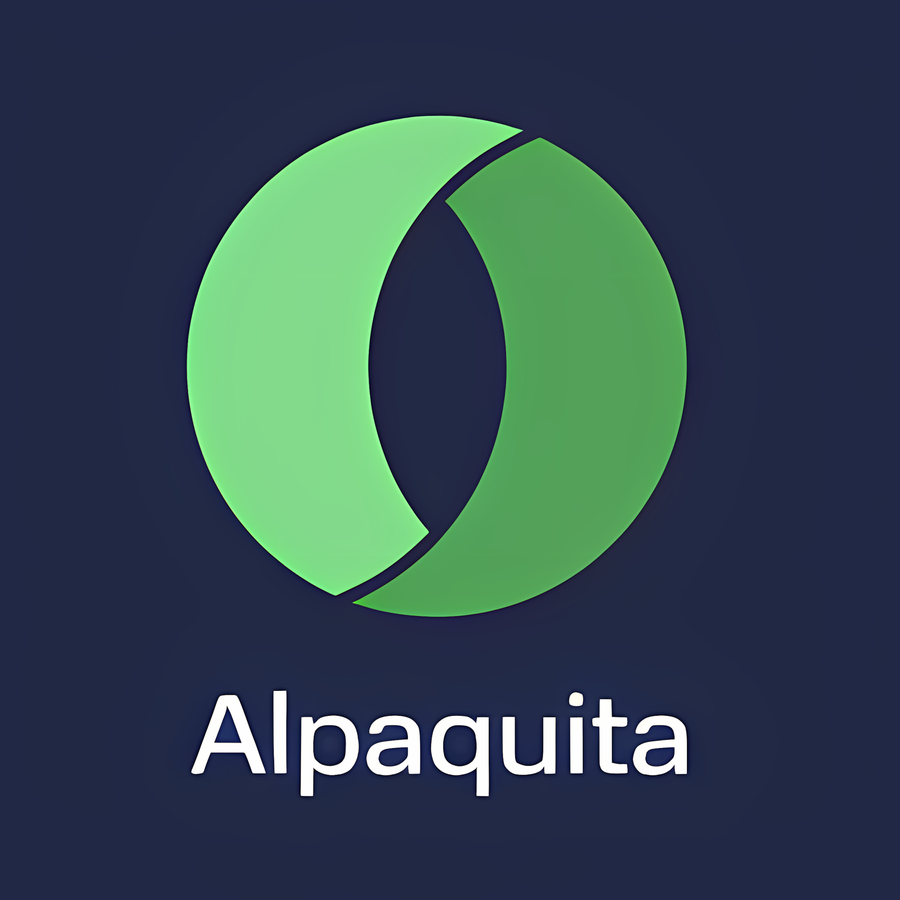

<div id="top"></div>

<!-- PROJECT SHIELDS -->
[![Contributors][contributors-shield]][contributors-url]
[![Forks][forks-shield]][forks-url]
[![Stargazers][stars-shield]][stars-url]
[![Issues][issues-shield]][issues-url]
[![GPL-2.0 License][license-shield]][license-url]

<!-- PROJECT LOGO -->
<br />
<div align="center">
  <a href="https://github.com/open-img-cloud/alpaquita-linux">
    
  </a>

<h3 align="center">Alpaquita Linux Cloud Images</h3>

  <p align="center">
    Cloud-init-ready, signed Alpaquita Linux images for OpenStack and Proxmox
    <br />
    <br />
    <a href="https://github.com/open-img-cloud/alpaquita-linux/issues">Report a bug</a>
    ·
    <a href="https://github.com/open-img-cloud/alpaquita-linux/issues">Request a feature</a>
  </p>
</div>

## About

This repo builds [Alpaquita Linux][alpaquita] cloud images on top of the
upstream Bell-SW [Stream qcow2][upstream-glibc] and customizes them via
`virt-customize` for OpenStack-style infrastructures. Both **glibc** and
**musl** libc variants are produced.

The build pipeline is shared with the rest of [`open-img-cloud`][org]:
this repo only ships the `VERSION`, `customize.sh`, `detect-upstream.sh`,
config files, and two thin caller workflows that delegate to the
reusable workflows in [`open-img-cloud/.github`][shared] (`@main`).

Customizations applied to the upstream rootfs:

- **cloud-init** with `OpenStack` + `ConfigDrive` datasources, default
  user `alpaquita` (sudo NOPASSWD, ssh-key-only, `lock_passwd: False`)
- **qemu-guest-agent**, **openssh-server**, **dhcpcd** enabled at boot
- **Serial console** wired (`ttyS0,115200n8`) for cloud / hypervisor consoles
- **`apk update && upgrade`** at build time, `/var/cache/apk` purged after
- **`virt-sysprep`** to clean transient state, then `virt-sparsify --compress`

Each release publishes:

- `alpaquita-<version>-{glibc,musl}-x86_64.qcow2`
- `*.sha256`, `*.sha1`, `*.md5` per-file
- `*.bundle` cosign sigstore-bundle (signature + cert + Rekor proof)
- `MANIFEST-glibc.json` + `MANIFEST-musl.json` (per-variant build metadata,
  including the builder image digest used to produce the qcow2)
- `index.html` directory listing

## Where to download

Public CDN, served via Cloudflare in front of an R2 bucket (mirror of
the source-of-truth Garage):

| URL pattern                                                                            | Cache policy                  |
|----------------------------------------------------------------------------------------|-------------------------------|
| `https://images.openimages.cloud/alpaquita-linux/<version>/<filename>`                 | `max-age=31536000, immutable` |
| `https://images.openimages.cloud/alpaquita-linux/latest/<filename>`                    | `max-age=300`                 |

Browse: [images.openimages.cloud/alpaquita-linux/latest/][latest]

## Verify before deploy

cosign 3.x:

```sh
sha256sum -c <filename>.sha256                    # integrity
cosign verify-blob \
    --bundle <filename>.bundle \
    --new-bundle-format \
    --certificate-identity-regexp '^https://github.com/open-img-cloud/alpaquita-linux/' \
    --certificate-oidc-issuer https://token.actions.githubusercontent.com \
    <filename>                                     # provenance
```

The signature certificate identity points back to this repo's release
workflow on GitHub Actions; OIDC issuer is GitHub's. A successful
`Verified OK` proves the qcow2 was produced by this repo's CI from the
exact commit listed in `MANIFEST-<variant>.json`.

## How to use

### OpenStack

```sh
# Pull the qcow2 (replace <V> with the desired version, e.g. 2026.04.14)
curl -fLO https://images.openimages.cloud/alpaquita-linux/<V>/alpaquita-<V>-glibc-x86_64.qcow2

openstack image create \
    --disk-format qcow2 --container-format bare \
    --file alpaquita-<V>-glibc-x86_64.qcow2 \
    'Alpaquita Linux Stream (glibc) <V>'
```

### Proxmox VE

```sh
# Copy to Proxmox host
scp alpaquita-<V>-glibc-x86_64.qcow2 root@proxmox:/var/lib/vz/template/iso/

# On Proxmox: create a cloud-init template from the disk
qm create <VMID> --name alpaquita-template --memory 1024 --cores 2 --net0 virtio,bridge=vmbr0
qm importdisk <VMID> alpaquita-<V>-glibc-x86_64.qcow2 <STORAGE>
qm set <VMID> --scsihw virtio-scsi-pci --scsi0 <STORAGE>:vm-<VMID>-disk-0
qm set <VMID> --boot c --bootdisk scsi0
qm set <VMID> --ide2 <STORAGE>:cloudinit
qm set <VMID> --serial0 socket --vga serial0
qm set <VMID> --ciuser alpaquita --sshkeys ~/.ssh/authorized_keys --ipconfig0 ip=dhcp
```

## Release flow

1. **`watch.yml`** runs daily 06:17 UTC, calls `build/detect-upstream.sh`
   which polls Bell-SW's `Last-Modified` header on both glibc and musl
   `-latest-` URLs and prints `YYYY.MM.DD` (max of the two).
2. If the date differs from the current `VERSION`, the workflow opens
   (or updates) a PR `auto/upstream-bump`.
3. Merging the PR + pushing a `v<VERSION>` tag fires `release.yml`,
   which calls the shared `build-libguestfs-image.yml@main` reusable
   workflow once per `libc` (`glibc`, `musl`).
4. Each build verifies the upstream qcow2.xz SHA256, runs
   `customize.sh`, sysprep, sparsify, signs, and uploads to Garage + R2
   under `s3://alpaquita-linux/<version>/`. The `latest/` alias is
   replaced and Cloudflare cache for `latest/` is purged.

## Repository layout

```
VERSION                          single line, e.g. "2026.04.14"
build/
  customize.sh                   virt-customize hook (qcow2 path as $1)
  detect-upstream.sh             prints latest upstream version (max glibc, musl)
  config/
    cloud.cfg                    cloud-init config copied to /etc/cloud/
    grub                         GRUB defaults with serial console
    serial-config.sh             enables ttyS0 in inittab + securetty
.github/workflows/
  release.yml                    calls build-libguestfs-image.yml on tag push
  watch.yml                      daily cron, calls upstream-watch.yml
.gitignore                       repo-local override for global build/ exclusion
LICENSE                          GPL-2.0
```

## Contributing

Fork, branch, PR. Keep changes focused; the customize hook in particular
is consumed by the shared pipeline so backward-compatible tweaks are
preferred over rewrites.

## License

Distributed under the GPL-2.0 License. See `LICENSE`.

## Contact

Kevin Allioli — kevin@stackops.ch · [@stackopshq](https://twitter.com/stackopshq)

Project: [open-img-cloud/alpaquita-linux](https://github.com/open-img-cloud/alpaquita-linux)

[alpaquita]: https://bell-sw.com/alpaquita-linux/
[upstream-glibc]: https://packages.bell-sw.com/alpaquita/glibc/stream/releases/x86_64/
[org]: https://github.com/open-img-cloud
[shared]: https://github.com/open-img-cloud/.github
[latest]: https://images.openimages.cloud/alpaquita-linux/latest/

<!-- shields -->
[contributors-shield]: https://img.shields.io/github/contributors/open-img-cloud/alpaquita-linux.svg?style=for-the-badge
[contributors-url]: https://github.com/open-img-cloud/alpaquita-linux/graphs/contributors
[forks-shield]: https://img.shields.io/github/forks/open-img-cloud/alpaquita-linux.svg?style=for-the-badge
[forks-url]: https://github.com/open-img-cloud/alpaquita-linux/network/members
[stars-shield]: https://img.shields.io/github/stars/open-img-cloud/alpaquita-linux.svg?style=for-the-badge
[stars-url]: https://github.com/open-img-cloud/alpaquita-linux/stargazers
[issues-shield]: https://img.shields.io/github/issues/open-img-cloud/alpaquita-linux.svg?style=for-the-badge
[issues-url]: https://github.com/open-img-cloud/alpaquita-linux/issues
[license-shield]: https://img.shields.io/github/license/open-img-cloud/alpaquita-linux.svg?style=for-the-badge
[license-url]: https://github.com/open-img-cloud/alpaquita-linux/blob/main/LICENSE
